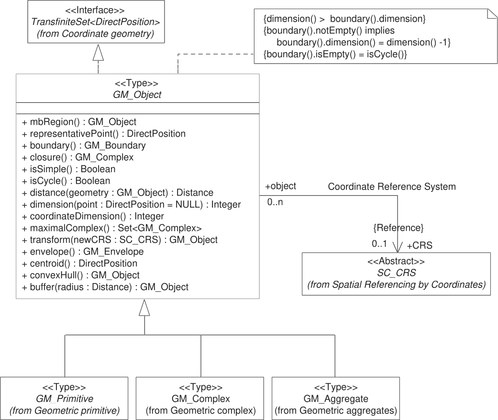
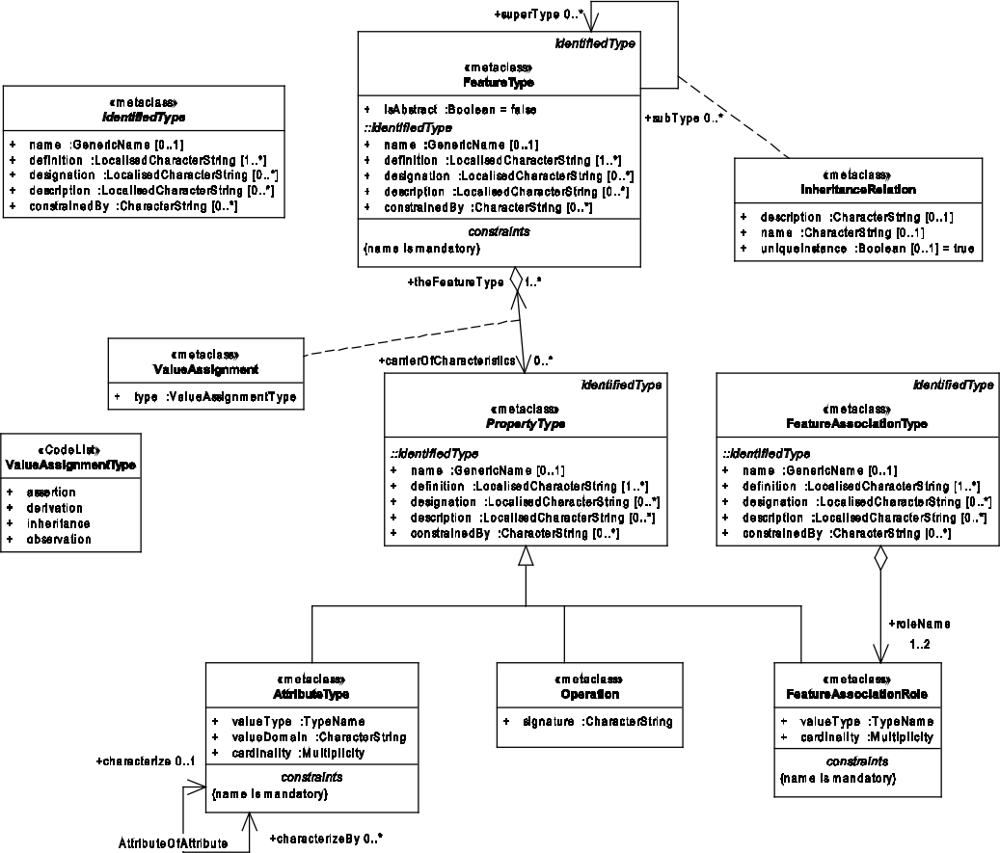
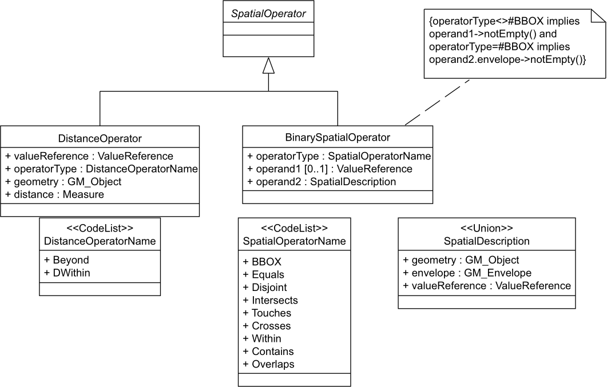
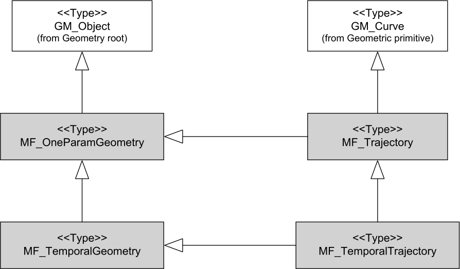
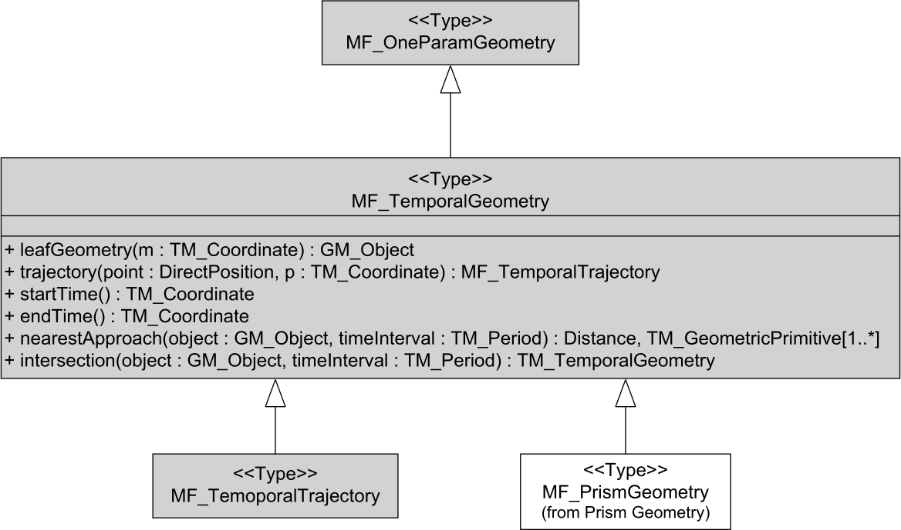
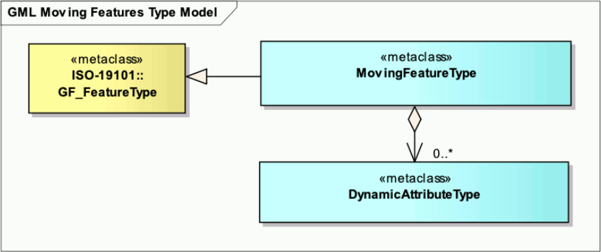

[appendix]
:appendix-caption: Annex
== Relationship with other OGC/ISO standards (Informative)

This specification is built upon the following OGC/ISO standards.
The geometry concept is presented first, followed by the feature concept.
Note that a feature is _not_ a geometry, but a feature often contains a geometry as one of its attributes.
However, it is legal to build features without geometry attribute, or with more than one geometry attributes.

=== Static geometries, features and accesses

The following standards define static objects, without time-varying properties.

==== Geometry (ISO 19107)

The ISO 19107, _Geographic information — Spatial schema_ standard
defines a `GM_Object` base type which is the root of all geometric objects.
Some examples of `GM_Object` subtypes are `GM_Point`, `GM_Curve`, `GM_Surface` and `GM_Solid`.
A `GM_Object` instance can be regarded as an infinite set of points in a particular coordinate reference system.
The standard provides a `GM_CurveInterpolation` code list to identify how those points are computed from a finite set of points.
Some interpolation methods listed by ISO 19107 are (non-exhaustive list):

linear::
Positions on a straight line between each consecutive pair of control points.

geodesic::
Positions on a geodesic curve between each consecutive pair of control points.
A geodesic curve is a curve of shortest length.
The geodesic shall be determined in the coordinate reference system of the curve.

circularArc3Points::
For each set of three consecutive control points,
a circular arc passing from the first point through the middle point to the third point.
Note: if the three points are co-linear, the circular arc becomes a straight line.

elliptical::
For each set of four consecutive control points,
an elliptical arc passing from the first point through the middle points in order to the fourth point.
Note: if the four points are co-linear, the arc becomes a straight line.
If the four points are on the same circle, the arc becomes a circular one.

cubicSpline::
The control points are interpolated using initial tangents and cubic polynomials, a form of degree 3 polynomial spline.

The UML below shows the `GM_Object` base type with its operations
(e.g. `distance(…)` for computing the distance between two geometries).
`GM_Curve` (not shown in this UML) is a subtype of `GM_Primitive`.
All operations assume static objects, without time-varying coordinates or attributes.

.GM_Object from ISO 19107:2003 figure 6

// **TODO:** above discussion is based on ISO 19107:2003. It needs to be updated for latest revisions.

// **TODO:** provide a simplified version of this UML.

Geometry, topology and temporal-objects (`GM_Object`, `TP_Object`, `TM_Object`) are not abstractions of real-world phenomena.
These types can provide types for feature properties as described in the next section, but cannot be specialized to features.

==== Features (ISO 19109)

The ISO 19109, _Geographic information — Rules for application schema_ standard
defines types for the definition of features.
A feature is an abstraction of a real-world phenomena.
The terms “feature type” and “feature instance” are used to separate the following concepts of “feature”:

Feature type::
The whole collection of real-world phenomena classified in a concept.
For example the “bridge” feature type is the abstraction of the collection of all real-world phenomena
that is classified into the concept behind the term “bridge”.

Feature instance::
A certain occurrence of a feature type.
For example “Tower Bridge” feature instance is the abstraction of a certain real-world bridge in London.

In object-oriented modelling, feature types are equivalent to classes and feature instances are equivalent to objects,

The UML below shows the General Feature Model.
`FeatureType` is a metaclass that is instantiated as classes that represent individual feature types.
A `FeatureType` instance contains the list of properties (attributes, associations and operations)
that feature instances of that type can contain.
Geometries are properties like any other, without any special treatment.
All properties are static, without time-varying values.

.General Feature Model from ISO 19109:2009 figure 5

// **TODO:** provide a simplified version of this UML.

==== Simple Features SQL

The link:https://portal.ogc.org/files/?artifact_id=25354[Simple Feature Access — Part 2: SQL Option] standard
describes a feature access implementation in SQL based on a profile of ISO 19107.
This standard defines _feature table_ as a table where the columns represent feature attributes,
and the rows represent feature instances.
The geometry of a feature is one of its feature attributes.

==== Filter Encoding (ISO 19143)

The ISO 19143, _Geographic information — Filter encoding_ standard
(also link:https://portal.ogc.org/files/?artifact_id=39968[OGC standard]) provides types for constructing queries.
These objects can be transformed into a SQL “SELECT … FROM … WHERE … ORDER BY …” statement to fetch data stored in a SQL-based relational database.
Similarly, the same objects can be transformed into an XQuery expression in order to retrieve data from XML document.
The UML below shows the objects used for querying a subset based on spatial operations such as “contains” or “intersects”.

.Spatial operators from ISO 19143 figure 6

==== Features web API

The link:http://docs.opengeospatial.org/is/17-069r3/17-069r3.html[OGC 17-069, _Features — Part 1: Core_] standard
specifies the fundamental building blocks for interacting with features using Web API.
This base standards allow to get all features available on a server,
or to get feature instances by their identifier.

==== Features Filtering web API

The link:https://portal.ogc.org/files/96288[OGC TBD, _Features — Part 3: Filtering and the Common Query Language (CQL)_] standard
extends the Feature web API with capabilities to encode more sophisticated queries.
The conceptual model is close to ISO 19143.

=== Temporal geometries and moving Features

==== Moving Features (ISO 19141)

The ISO 19141, _Geographic information — Schema for moving features_ standard
extends the ISO 19107 spatial schema for addressing features whose locations change over time.
Despite the “Moving Features” name, that standard is more about “Moving geometries”.
The UML below shows how the `MF_Trajectory` type extends the “static” types from ISO 19107.

.Trajectory type from ISO 19141 figure 3

Trajectory inherits some operations shown below.
Those operations are in addition to the operations inherited from `GM_Object`.
For example the `distance(…)` operation from ISO 19107 is now completed by a `nearestApproach(…)` operation.

.Temporal geometry from ISO 19141 figure 6

==== Moving Features XML encoding (OGC 18-075)

The link:http://docs.opengeospatial.org/is/18-075/18-075.html[OGC 18-075 _Moving Features Encoding Part I: XML Core_]
standard takes a subset of ISO 19141 specification and encodes it in XML format.
But that standard also completes ISO 19141 by allowing to specify attributes whose value change over time.
This extension to above _General Feature Model_ is shown below:

.Dynamic attribute from OGC 18-075 figure 3

==== Moving Features JSON encoding (OGC 19-045)

The link:http://docs.opengeospatial.org/is/19-045r3/19-045r3.html[OGC 19-045 _Moving Features Encoding Extension — JSON_]
standard takes a subset of ISO 19141 specification and encodes it in JSON format.
The specification provides various UML diagrams summarizing ISO 19141.

// ==== Moving Feature Access
//
// The link:http://docs.opengeospatial.org/is/16-120r3/16-120r3.html[OGC 16-120, _Moving Features Access_] standard
// (TODO)

