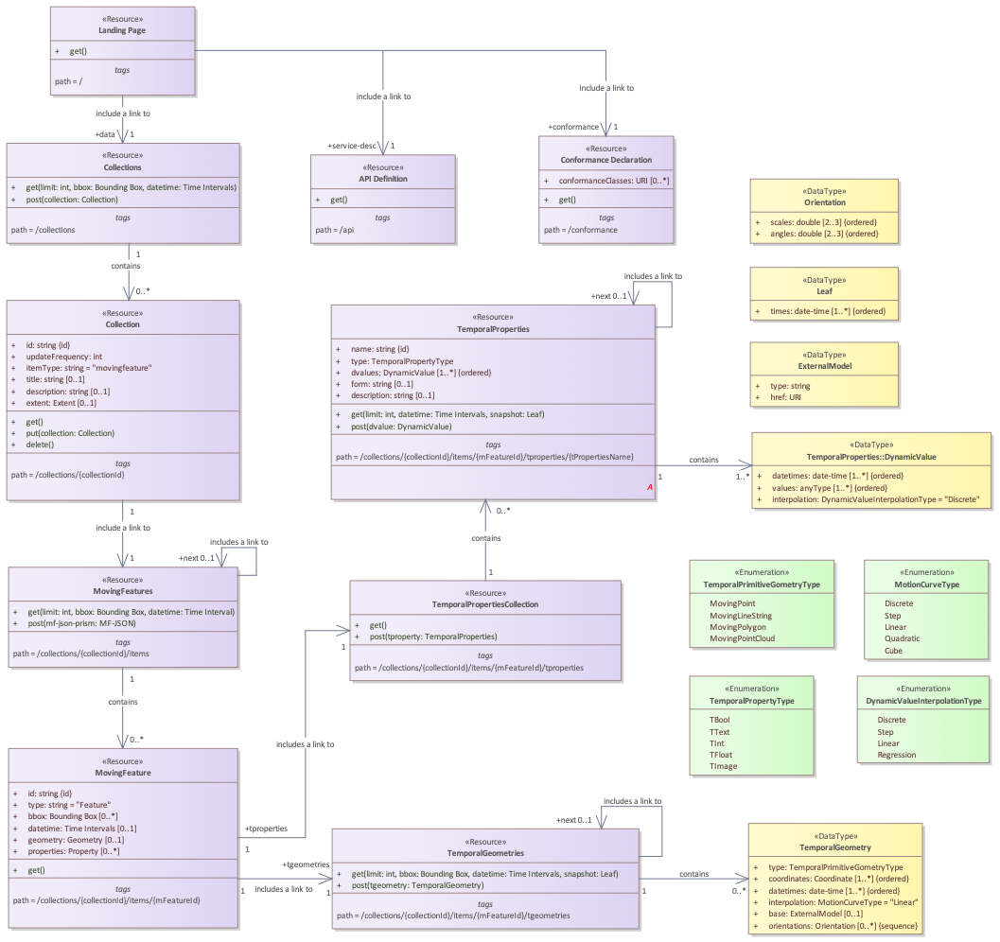

== Overview
=== General

<<OGC-API-Features,OGC API>> standards enable access to resources using the HTTP protocol and its associated operations (GET, PUT, POST, etc.)
<<OGC-API-Common,OGC API-Common>> defines a set of features which are applicable to all OGC APIs.
Other OGC standards extend API-Common with features specific to a resource type.
This OGC API-MovingFeatures standard defines an API with two goals:

. Provide access to *_Moving Features_* conformance to the <<OGC-MF-JSON,OGC Moving Features JSON encoding standard>>.
. Provide functionality comparable to that of the <<OGC-MF-Access,OGC Moving Features Access standard>>.

Resources exposed through an OGC API may be accessed through a Universal Resource Identifier (URI). URIs are composed of three sections:

* Dataset distribution API: The endpoint corresponding to a dataset distribution, where the landing page resource as defined in OGC API-Common-Part 1: Core is available (subsequently referred to as Base URI or `{root}`)
* Access Paths: Unique paths to Resources
* Query Parameters: Parameters to adjust the representation of a Resource or Resources like encoding format or sub-setting

Access Paths are used to build resource identifiers.
It is recommended, but not required.
Most resources are also accessible through links on previously accessed resources.
Unique relation types are used for each resource.

<<mf-api-paths>> summarizes the access paths and relation types defined in this standard.

[#mf-api-paths,reftext='{table-caption} {counter:table-num}']
.Moving Features API Paths
[width="90%",cols="2,^1,4",options="header"]
|===
^|**Path Template** ^|**Relation** ^|**Resource**

3+^|**Common**
|{root}/|none|Landing page for this dataset distribution
|{root}/api|`service-desc or service-doc`|API Description
|{root}/conformance|`conformance`|Conformance Classes

3+^|**Collections**
|<<resource-collections-section,{root}/collections>>|`data`
|Metadata describing the <<collection-schema,Collection Catalog>> of data available from this API.
|<<resource-collection-section,{root}/collections/{collectionId}>>|
|Metadata describing the <<collection-schema,Collection Catalog>> of data which has the unique identifier `{collectionId}`

3+^|**Moving Features**
|<<resource-mfeatures-section,{root}/collections/{collectionId}/items>>|`items`
|Static information of <<resource-movingfeature-section, MovingFeature>> about available items in the specified <<resource-collection-section, Collection>>
|<<resource-movingfeature-section,{root}/collections/{collectionId}/items/{mFeatureId}>>|`item`
|Static information describing the <<movingfeature-schema, MovingFeature>> of data which has the unique identifier `{mFeatureId}`
|<<resource-temporalGeometries-section,{root}/collections/{collectionId}/items/{mFeatureId}/tgeometries>>|`items`
|Temporal object information of <<resource-temporalGeometries-section, TemporalGeometries>> about available items in the specified <<resource-movingfeature-section, MovingFeature>>
|<<resource-tproperties-collection-section,{root}/collections/{collectionId}/items/{mFeatureId}/tproperties>>|`items`
|Temporal object information of <<resource-temporalProperties-section, TemporalProperties>> about available items in the specified <<resource-movingfeature-section, MovingFeature>>
|<<resource-temporalProperties-section,{root}/collections/{collectionId}/items/{mFeatureId}/tproperties/{tPropertiesName}>>|`item`
|Temporal object describing the <<resource-temporalProperties-section, TemporalProperties>> of data which has the unique identifier `{tPropertiesName}`
|===

Where:

* `{root}`          = Base URI for the API server
* `{collectionId}`  = An identifier for a specific <<resource-collection-section,Collection>> of data
* `{mFeatureId}`    = An identifier for a specific <<resource-movingfeature-section,MovingFeature>> of a specific <<resource-collection-section,Collection>> of data
* `{tPropertiesName}` = An identifier for a specific <<resource-temporalProperties-section,TemporalProperties>> of a specific <<resource-movingfeature-section,MovingFeatures>> of data

<<mf-api-class-diagram>> shows a UML class diagram for MF-API which represents the basic resources of this standard, such as `Collections`, `Collection`, `MovingFeature`, `TemporalGeometries`, `TemporalPropertiesCollection`, and `TemporalProperties`.
In this standard, a single moving feature can have temporal geometries, such as a set of trajectories.
Also, the moving feature can have temporal properties, such as a set of parametric values.

[#mf-api-class-diagram,reftext='{figure-caption} {counter:figure-num}']
.Class diagram for MF-API

//[[mf-json-encoding-schema-overview]]
//=== Moving Features Implementation Schema
//
//This OGC API-MovingFeatures standard establishes how to access resources as defined by the https://docs.opengeospatial.org/is/19-045r3/19-045r3.html[OGC Moving Features Encoding Extension - JSON] (shortly, MF-JSON) through Web APIs. The MF-JSON has two encoding formats:
//
//* MF-JSON Trajectory specifies how to map/interpret linear trajectories of moving points into/from the GeoJSON. MF-JSON Trajectory is to represent instances of the `MF_TemporalGeometry` type with linear interpolation.
//* MF-JSON Prism encoding can represent not only the movement of `MF_TemporalGeometry`, but also the movement of `MF_PrismGeometry` and `MF_RigidTemporalGeometry` of a feature which may be 0D, 1D, 2D, 3D geometric primitives, or their aggregations. Note that `MF_TemporalGeometry`, `MF_PrismGeometry`, and `MF_RigidTemporalGeometry` are types in the conceptual model of ISO 19141.
//
//The MF-JSON Prism can cover all contents of the MF-JSON Trajectory. This standard focus on the resources type in MF-JSON Prism.
//
//<<mf-prism-uml>> shows a UML class diagram for MF-JSON Prism which represents the basic resources of this standard, such as `MovingFeature`, `MovingFeatureCollection`, `TemporalGeometry`, and `TemporalProperties`.
//
//[#mf-prism-uml,reftext='{figure-caption} {counter:figure-num}']
//.Class diagram for MF-JSON Prism
//image::./images/mf-geojson-prism.png[mf-prism-uml, pdfwidth=100%, width=95%, align="center"]
//
//
//[[mf-access-overview]]
//=== Moving Features Access Schema
//
//T.B.D

[[api-behavior-model-overview]]
=== API Behavior Model

T.B.D

=== Search

The core search capability is based on https://ogcapi.ogc.org/common/[OGC API-Common] and thus supports:

* bounding box searches,
* time instant or time period searches,
* and equality predicates (i.e. _property_=_value_).

OGC API-MovingFeatures extends these core search capabilities to include:

* keyword searches.

[[dependencies-overview]]
=== Dependencies

The OGC API-MovingFeatures (shortly, API-MF) standard is an extension of the OGC API-Common and the OGC API-Features standards.
Therefore, an implementation of API-MF shall first satisfy the appropriate Requirements Classes from API-Common and API-Features.
<<req-mappings>>, identifies the OGC API - Common and OGC API - Features Requirements Classes which are applicable to each section of this Standard.
Instructions on when and how to apply these Requirements Classes are provided in each section.

[#req-mappings,reftext='{table-caption} {counter:table-num}']
.Required OGC API - Common and OGC API - Features Requirements Classes
[width="90%",cols="2,6"]
|====
^|*API - Record Section*           ^| *OGC API - Common, OGC API - Features Requirements Class*
|API Landing Page                   | http://www.opengis.net/spec/ogcapi-common-1/1.0/req/landing-page
|API Definition                      | http://www.opengis.net/spec/ogcapi-common-1/1.0/req/landing-page
|Declaration of Conformance Classes | http://www.opengis.net/spec/ogcapi-common-1/1.0/req/landing-page
|Collections                        | http://www.opengis.net/spec/ogcapi-common-2/1.0/req/collections
|Collection                         | http://www.opengis.net/spec/ogcapi-common-2/1.0/req/collections
|Features                           | http://www.opengis.net/spec/ogcapi-features-1/1.0/req/core
|MovingFeature                      | http://www.opengis.net/spec/ogcapi-features-1/1.0/req/core
|TemporalGeometries                 | http://www.opengis.net/spec/ogcapi-features-1/1.0/req/core
|TemporalPropertiesCollection       | http://www.opengis.net/spec/ogcapi-features-1/1.0/req/core
|TemporalProperties                 | http://www.opengis.net/spec/ogcapi-features-1/1.0/req/core
|OpenAPI 3.0                        | http://www.opengis.net/spec/ogcapi-features-1/1.0/conf/oas30
|GeoJSON                            | http://www.opengis.net/spec/ogcapi-features-1/1.0/conf/geojson
|====