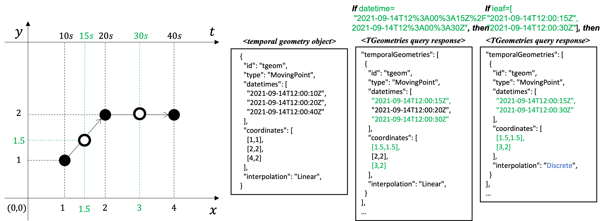

[[clause-core-movingfeature]]
== Requirements Class "Moving Features"
=== Overview
include::requirements/movingfeature/requirements_class_movingfeature.adoc[]

The `Moving Features` requirements class defines the requirements for a moving feature.
A moving feature is an object that provide information about and access to a set of related <<resource-temporalGeometries-section, TemporalGeometries>> and <<resource-tproperties-collection-section, TemporalPropertiesCollection>>.

=== Information Resources
The five resources defined in this Requirements Class are summarized in <<mf-resources>>.

[#mf-resources,reftext='{table-caption} {counter:table-num}']
.Moving Features Resources
[width="90%",cols="10,10,10",options="header"]
|===
^|Resource ^|URI ^|HTTP Method
|<<resource-mfeatures-section,MovingFeatures>>
|`{root}/collections/{collectionId}/items`
^|GET, POST
//|Add a new resource (<<resource-movingfeature-section,MovingFeature>>) feature to a specific <<resource-collection-section,Collection>> (specified by {collectinoId})

|<<resource-movingfeature-section,MovingFeature>>
|`{root}/collections/
{collectionId}/items/
{mfeatureId}`
^|GET, DELETE

|<<resource-temporalGeometries-section,TemporalGeometries>>
|`{root}/collections/
{collectionId}/items/
{mFeatureId}/tgeometries`
^|GET, POST

|<<resource-tproperties-collection-section,TemporalPropertiesCollection>>
|`{root}/collections/
{collectionId}/items/
{mFeatureId}/tproperties`
^|GET, POST

|<<resource-temporalProperties-section,TemporalProperties>>
|`{root}/collections/
{collectionId}/items/
{mFeatureId}/tproperties/
{tPropertiesName}`
^|GET, POST|
|===

[[resource-mfeatures-section]]
=== Resource MovingFeatures
The `MovingFeatures` resource supports retrieving and creating operations via GET and POST HTTP methods respectively.

. Retrieving operation returns a set of features which describes the moving feature available from this API.
. Creating operation post a new <<resource-movingfeature-section,MovingFeature>> resource instance to a specific <<resource-collection-section,Collection>> (specified by {collectinoId} with this API.

The MF-API `Items` query is an OGC API-Features endpoint that may be used to catalog pre-existing moving features.
If a `mFeatureID` is not specified, the query will return a list of the available moving features.
The list of moving features returned to the response can be limited using the <<bbox-section,bbox>>, <<datetime-section,datetime>>, and <<limit-section,limit>> parameters.
This behavior is specified in OGC API-Features.
All parameters for use with the `Items` query are defined by OGC API-Features.

==== Operation
===== Retrieve
This operation is defined in the `MovingFeatures` conformance class of API-Features.
No modifications are needed to support <<resource-movingfeature-section,MovingFeature>> resources.

. Issue a `GET` request on `{root}/collections/{collledctionID}/items` path

Support for GET on the `{root}/collections/{collledctionID}/items` path is required by API-Features.

include::requirements/movingfeature/features/REQ_operation-features-get.adoc[]

====== Create
This operation is defined in the `http://docs.ogc.org/DRAFTS/20-002.html#create[CREATE]` conformance class of API-Features.
This operation targeted <<resource-movingfeature-section,MovingFeature>> resource.

. Issue a `POST` request on `{root}/collections/{collledctionID}/items` path

Support for HTTP POST method is required by API-Features.

include::requirements/movingfeature/features/REQ_operation-features-post.adoc[]

The following example adds a new feature (https://docs.opengeospatial.org/is/19-045r3/19-045r3.html#mfeature[MovingFeature object] in <<OGC-MF-JSON,MF-JSON>>) to the specific <<resource-collection-section,Collection>>.
The feature is represented as <OGC-MF-JSON,MF-JSON>>, which is a kind of extension of the https://datatracker.ietf.org/doc/html/rfc7946#section-3.2[GeoJSON].
A pseudo-sequence diagram notation is used to illustrate the details of the HTTP communication between the client and the server.
[#movingfeature-post-example,reftext='Create a New MovingFeature Object Example']
.Create a New MovingFeature Object Example
include::examples/features-post.adoc[]

==== Response
===== Retrieve
A successful response to the `MovingFeatures` GET operation is a document that contains the static data of moving features.
In a typical API deployment, the `MovingFeatures` GET response will list features of all offered resource types.

include::requirements/movingfeature/features/REQ_response-features-get.adoc[]

[#features-schema,reftext='MovingFeatures GET Response Schema']
.Features GET Response Schema
[source,yaml]
----
include::schema/featureCollection.yaml[]
----

The following JSON payload is an example of a response to an OGC API-MovingFeatures `MovingFeatures` GET operation.
[#features-example,reftext=`MovingFeatures Example`]
.MovingFeatures GET Example
[source,json]
----
include::examples/features.json[]
----

====== Create
A successful response to the `MovingFeatures` POST operation is an HTTP status code.

include::requirements/movingfeature/features/REQ_response-features-post.adoc[]

==== Error situations
The requirements for handling unsuccessful requests are provided in <<http-response>>.
General guidance on HTTP status codes and how they should be handled is provided in <<http-status-codes>>.

[[resource-movingfeature-section]]
=== Resource MovingFeature
==== Overview
A MovingFeature object consists of the set of static information that describes a single moving feature and the set of temporal object information, such as temporal geometry and temporal property.
An abbreviated copy of this information is returned for each `MovingFeature` in the `{root}/collections/{collectionId}/items` GET response.

The schema for the moving feature object presented in this clause is an extension of the `GeoJSON Feature Object` defined in https://datatracker.ietf.org/doc/html/rfc7946#section-3.2[GeoJSON].
<<moving-feature-properties-table>> defines the set of properties that may be used to describe a moving feature.

[[moving-feature-properties-table]]
[reftext='{table-caption} {counter:table-num}']
.Table of the properties related to the moving feature
[cols="30,5,65",options="header"]
|===
|Property           |Requirement    |Description
|_**id**_           |M |A unique record identifier assigned by the server.
|_**type**_         |M |A feature type of GeoJSON (i.e., one of 'Feature' or 'FeatureCollection').
|_**geometry**_     |M |A projective geometry of the moving feature.
|_**properties**_   |O |A set of property of GeoJSON.
|_**bbox**_         |O |A bounding box information for the moving feature.
|interval           |O |A life span information for the moving feature.
|<<resource-temporalGeometries-section, temporalGeometries>> |O |A set of <<tgeometry-schema, temporal geometry>> of the moving feature.
|<<resource-tproperties-collection-section, temporalPropertiesCollection>> |O |A set of <<resource-temporalProperties-section, temporalProperties>> of the moving feature.
|===

NOTE: The properties _id_, _type_, _geometry_, _properties_, and _bbox_ were inherited from https://datatracker.ietf.org/doc/html/rfc7946#section-3.2[GeoJSON].

include::requirements/movingfeature/movingfeature/REQ_mandatory-movingfeature.adoc[]

==== Operation
//TODO: Why Replace operation is not supported
===== Retrieve
This operation is defined in the `Feature` conformance class of API-Features.
No modifications are needed to support <<resource-movingfeature-section,MovingFeature>> resources.

. Issue a `GET` request on the `{root}/collections/{collectionId}/items/{mFeatureId}` path

[[movingfeature-identifier]]
The {mFeatureId} parameter is the unique identifier for a single moving feature offered by the API.
The list of valid values for `{mFeatureId}` is provided in the <<resource-mfeatures-section,`{root}/collections/{collectionId}/items`>> GET response.

Support for GET on the `{root}/collections/{collledctionID}/items/{mFeatureId}` path is required by API-Features.

include::requirements/movingfeature/movingfeature/REQ_operation-movingfeature-get.adoc[]

===== Delete
This operation is defined in the `http://docs.ogc.org/DRAFTS/20-002.html#delete[DELETE]` conformance class of API-Features.

. Issue a `DELETE` request on `{root}/collections/{collectionId}/items/{mFeatureId}` path

Support for HTTP DELETE method is required by API-Features.

include::requirements/movingfeature/movingfeature/REQ_operation-movingfeature-delete.adoc[]

==== Response
===== Retrieve
A successful response to the `MovingFeature` GET operation is a set of metadata that describes the moving feature identified by the <<movingfeature-identifier,`{mFeatureId}`>> parameter.
This response doesn't include a set of temporal object information.
The temporal object information may access by <<resource-temporalGeometries-section, TemporalGeometries>> and <<resource-tproperties-collection-section, TemporalPropertiesCollection>> operation.

include::requirements/movingfeature/movingfeature/REQ_response-movingfeature-get.adoc[]

[#movingfeature-schema,reftext='MovingFeature GET Response Schema']
.MovingFeature GET Response Schema
[source,yaml]
----
include::schema/movingFeatureGeoJSON.yaml[]
----

The `interval` property of the `MovingFeature` response represents a particular period of moving feature existence.

The following JSON payload is an example of a response to an OGC API-MovingFeatures `MovingFeature` operation.
[#movingfeature-example,reftext=`MovingFeature Example`]
.MovingFeature Example
[source,json]
----
include::examples/feature.json[]
----

===== Delete
A successful response to the `Collection` DELETE operation is an HTTP status code.

include::requirements/movingfeature/movingfeature/REQ_response-movingfeature-delete.adoc[]

==== Error situations
The requirements for handling unsuccessful requests are provided in <<http-response>>.
General guidance on HTTP status codes and how they should be handled is provided in <<http-status-codes>>.

[[resource-temporalGeometries-section]]
=== Resource TemporalGeometries
The `TemporalGeometries` resource supports retrieving and creating operations via GET and POST HTTP methods respectively.

. Retrieving operation returns a set of temporal geometry object which is included in the <<resource-movingfeature-section,`MovingFeature`>> that specified by <<movingfeature-identifier,{mFeatureId}>>. The set of temporal geometry object returned to the response can be limited using the <<limit-section,`limit`>>, <<bbox-section,`bbox`>>, <<datetime-section,`datetime`>>, and <<leaf-section,`leaf`>> parameters.
. Creating operation post a new temporal geometry object to the <<resource-movingfeature-section,`MovingFeature`>> that specified by <<movingfeature-identifier,{mFeatureId}>>.

[[temporal-geometry-object]]
A temporal geometry object represents the movement of a moving feature with various types of moving geometry, i.e., `MovingPoint`, `MovingLineString`, `MovingPolygon`, and `MovingPointCloud`. It can also represent the movement of a 3D object with its orientation.

The schema for the temporal geometry object presented in this clause is an extension of the `TemporalGeometry Object` defined in https://docs.opengeospatial.org/is/19-045r3/19-045r3.html#tgeometry[MF-JSON standard].
<<temporalGeometry-properties-table>> defines the set of properties that may be used to describe a temporal geometry.

[[temporalGeometry-properties-table]]
[reftext='{table-caption} {counter:table-num}']
.Table of the properties related to the temporal geometry
[cols="30,5,65",options="header"]
|===
|Property           |Requirement    |Description
//|id                 |M |An identifier for the resource assigned by an external entity.
|type               |M |A primitive geometry type of MF-JSON (i.e., one of 'MovingPoint', 'MovingLineString', 'MovingPolygon', 'MovingPointCloud', or 'MovingGeometryCollection').
|datetimes          |M |A sequence of monotonic increasing instants.
|coordinates        |M |A sequence of leaf geometries of a temporal geometry, having the same number of elements as "datetimes".
|interpolation      |M |A predefined type of motion curve (i.e., one of 'Discrete', 'Step', 'Linear', 'Quadratic' or 'Cubic').
|base.type          |O |A type of 3D file format, such as STL, OBJ, PLY, and glTF.
|base.href          |O |A URL to address a 3D model data which represents a base geometry of a 3D shape.
|orientations.scales|O |An array value of numbers along the x, y, and z axis in order as three scale factors.
|orientations.angles|O |An array value of numbers along the x, y, and z axis in order as Euler angles in degree.
|===

NOTE: The detailed information and requirements for each property are described in the <<OGC-MF-JSON, OGC Moving Feature JSON encoding standard>>.

include::requirements/movingfeature/tgeometries/REQ_mandatory-temporalgeometry.adoc[]

==== Parameters
[[leaf-section]]
===== Parameter leaf
The `leaf` parameter is a sequence of monotonic increasing instants with date-time strings (ex. "2018-02-12T23:20:50Z") that adheres to RFC3339.
It consists of a list of the date-time format string, different from <<datetime-section, `datetime`>> parameter.
The array does not allow the same element.
//A sequence of monotonic increasing instants only temporal geometries that intersects the value of time is selected.

.Leaf valid (and invalid) Examples
=================
(O) "2018-02-12T23:20:50Z"

(O) "2018-02-12T23:20:50Z", "2018-02-12T23:30:50Z"

(O) "2018-02-12T23:20:50Z", "2018-02-12T23:30:50Z", "2018-02-12T23:40:50Z"

(X) "2018-02-12T23:20:50Z", "2018-02-12T23:20:50Z"

(X) "2018-02-12T23:20:50Z", "2018-02-12T22:20:50Z"
=================

If `leaf` parameter is provided by the client, the endpoint returns only geometry coordinate (or temporal property value) with the leaf query at each time included in the `leaf` parameter, similar to _**pointAtTime**_ operation in the https://docs.opengeospatial.org/is/16-120r3/16-120r3.html#12[OGC Moving Feature Access standard]. And `interpolation` property in the response SHALL be 'Discrete'.

[#leaf-example,reftext='{figure-caption} {counter:figure-num}']
.Example of response result with `leaf` parameter

include::requirements/parameter/REQ_parameter-leaf-definition.adoc[]

include::requirements/parameter/REQ_parameter-leaf-response.adoc[]

==== Operation
===== Retrieve
. Issue a `GET` request on the `{root}/collections/{collectionId}/items/{mFeatureId}/tgeometries` path

include::requirements/movingfeature/tgeometries/REQ_operation-tgeometries-get.adoc[]

====== Create
This operation is defined in the `http://docs.ogc.org/DRAFTS/20-002.html#create[CREATE]` conformance class of API-Features.
This operation targeted <<temporal-geometry-object,TemporalGeometry object>>.

. Issue a `POST` request on `{root}/collections/{collectionId}/items/{mFeatureId}/tgeometries` path

Support for HTTP POST method is required by API-Features.

include::requirements/movingfeature/tgeometries/REQ_operation-tgeometries-post.adoc[]

The following example adds a new feature (https://docs.opengeospatial.org/is/19-045r3/19-045r3.html#tgeometry[TemporalGeometry object] in <<OGC-MF-JSON,MF-JSON>>) to the feature created by the <<movingfeature-post-example,Create a MovingFeature Example>>.
The feature is represented as <OGC-MF-JSON,MF-JSON>>, which is a kind of extension of the https://datatracker.ietf.org/doc/html/rfc7946#section-3.2[GeoJSON].
//And it added to the current temporal geometry object as continuously one, because the time difference between these two temporal geometry objects is less than (or equal to) the update frequency of the created Collection feature by the <<collections-post-example,Create a New Collection Example>>.
A pseudo-sequence diagram notation is used to illustrate the details of the HTTP communication between the client and the server.
[#collections-post-example,reftext='Create a New TemporalGeometry Object Example']
.Create a New TemporalGeometry Object Example
include::examples/temporalGeometry-post.adoc[]

==== Response
===== Retrieve
A successful response to the `TemporalGeometries` GET operation is a document that contains the set of temporal geometry of the moving feature identified by the <<movingfeature-identifier,`{mFeatureId}`>> parameter.

include::requirements/movingfeature/tgeometries/REQ_response-tgeometries-get.adoc[]

[#tgeometries-schema,reftext='TemporalGeometries GET Response Schema']
.TemporalGeometries GET Response Schema
[source,yaml]
----
include::schema/temporalGeometries.yaml[]
----

[#tgeometry-schema,reftext='TemporalGeometry Schema']
.TemporalGeometry Schema (temporalGeometry.yaml)
[source,yaml]
----
include::schema/temporalGeometry.yaml[]
----

The following JSON payload is an example of a response to an OGC API-MovingFeatures `TemporalGeometries` GET operation.
[#tgeometries-example,reftext=`TemporalGeometries Example`]
.TemporalGeometries GET Example
[source,json]
----
include::examples/temporalGeometries.json[]
----

====== Create
A successful response to the `TemporalGeometries` POST operation is an HTTP status code.

include::requirements/movingfeature/tgeometries/REQ_response-tgeometries-post.adoc[]

==== Error situations
The requirements for handling unsuccessful requests are provided in <<http-response>>.
General guidance on HTTP status codes and how they should be handled is provided in <<http-status-codes>>.

[[resource-tproperties-collection-section]]
=== Resource TemporalPropertiesCollection
A `TemporalPropertiesCollection` object consists of the set of <<resource-temporalProperties-section,TemporalProperties>> which is included in the <<resource-movingfeature-section,`MovingFeature`>> that specified by <<movingfeature-identifier,{mFeatureId}>>.
The `TemporalPropertiesCollection` resource supports retrieving and creating operations via GET and POST HTTP methods respectively.

. Retrieving operation returns a list of the available abbreviated copy of <<resource-temporalProperties-section,TemporalProperties>> object in the specified moving feature.
. Creating operation post a new <<resource-temporalProperties-section,TemporalProperties>> object to the <<resource-movingfeature-section,`MovingFeature`>> that specified by <<movingfeature-identifier,{mFeatureId}>>.

//If a `tPropertiesName` is not specified, the query will return a list of the available parametric values in the specified moving feature.

==== Operation
===== Retrieve
. Issue a `GET` request on the `{root}/collections/{collectionId}/items/{mFeatureId}/tproperties` path

include::requirements/movingfeature/tproperties-collection/REQ_operation-tproperties-collection-get.adoc[]

====== Create
This operation is defined in the `http://docs.ogc.org/DRAFTS/20-002.html#create[CREATE]` conformance class of API-Features.
This operation targeted <<resource-temporalProperties-section,TemporalProperties>> resource.

. Issue a `POST` request on `{root}/collections/{collectionId}/items/{mFeatureId}/tproperties` path

Support for HTTP POST method is required by API-Features.

include::requirements/movingfeature/tproperties-collection/REQ_operation-tproperties-collection-post.adoc[]

The following example adds a new feature (<<resource-temporalProperties-section, TemporalProperties>> resource) to the feature created by the <<movingfeature-post-example,Create a MovingFeature Example>>.
The feature is represented as JSON.
A pseudo-sequence diagram notation is used to illustrate the details of the HTTP communication between the client and the server.
[#tproperties-post-example,reftext='Create a New TemporalProperties Object Example']
.Create a New TemporalProperties Object Example
include::examples/temporalProperties-post.adoc[]

==== Response
===== Retrieve
A successful response to the `TemporalPropertiesCollection` GET is a document that contains the set of <<resource-temporalProperties-section, TemporalProperties>> of the moving feature identified by the <<movingfeature-identifier,`{mFeatureId}`>> parameter.

include::requirements/movingfeature/tproperties-collection/REQ_response-tproperties-collection-get.adoc[]

[#pvalues-schema,reftext='TemporalPropertiesCollection GET Response Schema']
.TemporalPropertiesCollection GET Response Schema
[source,yaml]
----
include::schema/temporalPropertiesCollection.yaml[]
----

The following JSON payload is an example of a response to an OGC API-MovingFeatures `TemporalPropertiesCollection` GET operation.
[#pvalues-example,reftext=`TemporalPropertiesCollection GET Example`]
.TemporalPropertiesCollection GET Example
[source,json]
----
include::examples/temporalPropertiesCollection.json[]
----

====== Create
A successful response to the `TemporalPropertiesCollection` POST operation is an HTTP status code.

include::requirements/movingfeature/tproperties-collection/REQ_response-tproperties-collection-post.adoc[]

==== Error situations
The requirements for handling unsuccessful requests are provided in <<http-response>>.
General guidance on HTTP status codes and how they should be handled is provided in <<http-status-codes>>.

[[resource-temporalProperties-section]]
=== Resource TemporalProperties
==== Overview
The `TemporalProperties` resource supports retrieving and creating operations via GET and POST HTTP methods respectively.

. Retrieving operation returns a `TemporalProperties` resource which is included in the <<resource-tproperties-collection-section,`TemporalPropertiesCollection`>> that specified by <<tproperties-identifier,{tPropertiesName}>>. The `TemporalProperties` resource returned to the response can be limited using the <<limit-section,`limit`>>, <<datetime-section,`datetime`>>, and <<leaf-section,`leaf`>> parameters.
. Creating operation post a new dynamic value object to the <<resource-tproperties-collection-section,`TemporalPropertiesCollection`>> that specified by <<tproperties-identifier,{tPropertiesName}>>.

[[temporal-properties-object]]
A temporal properties object is a collection of dynamic non-spatial attributes and their dynamic values with time.
An abbreviated copy of this information is returned for each `TemporalProperties` in the `{root}/collections/{collectionId}/items/{mFeatureId}/tproperties` response.

The schema for the temporal properties object presented in this clause is an extension of the `TemporalProperties Object` defined in https://docs.opengeospatial.org/is/19-045r3/19-045r3.html#tproperties[MF-JSON standard].
<<temporalProperties-properties-table>> defines the set of properties that may be used to describe a temporal properties.

[[temporalProperties-properties-table]]
[reftext='{table-caption} {counter:table-num}']
.Table of the properties related to the temporal properties
[cols="30,5,65",options="header"]
|===
|Property           |Requirement    |Description
|name               |M |An identifier for the resource assigned by an external entity.
|type               |M |A temporal property type (i.e., one of 'TBool', 'TText', 'TInt', or 'TFloat').
|dvalues            |M |A sequence of <<dynamicvValue-properties-table, dynamic value>>
|form               |O |A unit of measure.
|description        |O |A short description.
|===

[[dynamicvValue-properties-table]]
[reftext='{table-caption} {counter:table-num}']
.Table of the properties related to the dynamic value
[cols="30,5,65",options="header"]
|===
|Property           |Requirement    |Description
|datetimes          |M |A sequence of monotonic increasing instants.
|values             |M |A sequence of dynamic value, having the same number of elements as "datetimes".
|interpolation      |M |A predefined type for a dynamic value (i.e., one of 'Discrete', 'Step', 'Linear', or 'Regression').
|===

NOTE: The detailed information and requirements for each property are described in the <<OGC-MF-JSON, OGC Moving Feature JSON encoding standard>>.

include::requirements/movingfeature/tproperties/REQ_mandatory-tproperties.adoc[]

==== Operation
===== Retrieve
. Issue a `GET` request on the `{root}/collections/{collectionId}/items/{mFeatureId}/tproperties/{tPropertiesName}` path

[[tproperties-identifier]]
The {tPropertiesName} parameter is the unique identifier for a single temporal properties value offered by the API.
The list of valid values for `{tPropertiesName}` is provided in the <<resource-tproperties-collection-section,`{root}/collections/{collectionId}/items/{mFeatureId}/tproperties`>> GET response.

include::requirements/movingfeature/tproperties/REQ_operation-tproperties-get.adoc[]

====== Create
This operation is defined in the `http://docs.ogc.org/DRAFTS/20-002.html#create[CREATE]` conformance class of API-Features.
This operation targeted <<dynamicvValue-properties-table,DynamicValue>> object.

. Issue a `POST` request on `{root}/collections/{collectionId}/items/{mFeatureId}/tproperties/{tPropertyName}` path

Support for HTTP POST method is required by API-Features.

include::requirements/movingfeature/tproperties/REQ_operation-tproperties-post.adoc[]

The following example adds a new feature (<<dynamicvValue-properties-table, DynamicValue>> object) to the feature created by the <<tproperties-post-example,Create a New TemporalProperties Object Example>>.
The feature is represented as JSON.
A pseudo-sequence diagram notation is used to illustrate the details of the HTTP communication between the client and the server.
[#collections-post-example,reftext='Create a New DynamicValue Object Example']
.Create a New DynamicValue Object Example
include::examples/dynamicValue-post.adoc[]

==== Response
===== Retrieve
A successful response to the `TemporalProperties` GET operation is a temporal properties identified by the <<tproperties-identifier,`{tPropertiesName}`>> parameter.

include::requirements/movingfeature/tproperties/REQ_response-tproperties-get.adoc[]

[#tproperties-schema,reftext='TemporalProperties Schema']
.TemporalProperties Schema (temporalProperties.yaml)
[source,yaml]
----
include::schema/temporalProperties.yaml[]
----

[#dvalue-schema,reftext='DynamicValue Schema']
.DynamicValue Schema (dynamicValue.yaml)
[source,yaml]
----
include::schema/dynamicValue.yaml[]
----

The following JSON payload is an example of a response to an OGC API-MovingFeatures `TemporalProperties` GET operation.
[#tproperties-example,reftext=`TemporalProperties GET Example`]
.TemporalProperties GET Example
[source,json]
----
include::examples/temporalProperties.json[]
----

====== Create
A successful response to the `TemporalGeometries` POST operation is an HTTP status code.

include::requirements/movingfeature/tproperties/REQ_response-tproperties-post.adoc[]

==== Error situations
The requirements for handling unsuccessful requests are provided in <<http-response>>.
General guidance on HTTP status codes and how they should be handled is provided in <<http-status-codes>>.