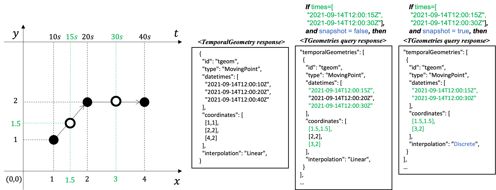

[[clause-core-movingfeature]]
== Requirements Class "Moving Features"
=== Overview
include::requirements/movingfeature/requirements_class_movingfeature.adoc[]

The `Moving Features` requirements class defines the requirements for a moving feature.
A moving feature is an object that provide information about and access to a set of related <<resource-temporalGeometry-section, TemporalGeometry>> and <<resource-temporalProperty-section, TemporalProperty>>.

=== Information Resources
The six resources defined in this Requirements Class are summarized in <<mf-resources>>.

[#mf-resources,reftext='{table-caption} {counter:table-num}']
.Moving Features Resources
[width="90%",cols="10,10,5",options="header"]
|===
^|Resource ^|URI ^|HTTP Method
|<<resource-features-section,Features>>  |`{root}/collections/{collectionId}/items` ^|GET
|<<resource-movingfeature-section,MovingFeature>> |`{root}/collections/{collectionId}/items/{mfeatureId}` ^|GET
|<<resource-temporalGeometries-section,TemporalGeometries>> |`{root}/collections/{collectionId}/items/{mFeatureId}/tgeometries` ^|GET
|<<resource-temporalGeometry-section,TemporalGeometry>> |`{root}/collections/{collectionId}/items/{mFeatureId}/tgeometries/{tGeometryId}` ^|GET
|<<resource-temporalProperties-section,TemporalProperties>> |`{root}/collections/{collectionId}/items/{mFeatureId}/tproperties` ^|GET
|<<resource-temporalProperty-section,TemporalProperty>> |`{root}/collections/{collectionId}/items/{mFeatureId}/tproperties/{tPropertyName}` ^|GET
|===

[[resource-features-section]]
=== Resource Features
The MF-API `Items` query is an OGC API-Features endpoint that may be used to catalog pre-existing moving features.
The `Features` operation returns a set of features which describes the moving feature available from this API.
If a `mFeatureID` is not specified, the query will return a list of the available moving features.
The list of moving features returned to the response can be limited using the <<bbox-section,bbox>>, <<datetime-section,datetime>>, and <<limit-section,limit>> parameters.
This behavior is specified in OGC API-Features.
All parameters for use with the `Items` query are defined by OGC API-Features.

==== Operation
This operation is defined in the `Features` conformance class of API-Features.
No modifications are needed to support <<resource-movingfeature-section,MovingFeature>> resources.

. Issue a `GET` request on `{root}/collections/{collledctionID}/items` path

Support for GET on the `{root}/collections/{collledctionID}/items` path is required by API-Features.

include::requirements/movingfeature/REQ_operation-features.adoc[]

==== Response
A successful response to the `Features` operation is a document that contains the static data of moving features.
In a typical API deployment, the `Features` response will list features of all offered resource types.

include::requirements/movingfeature/REQ_response-features.adoc[]

[#features-schema,reftext='Features Response Schema']
.Features Response Schema
[source,yaml]
----
include::schema/featureCollection.yaml[]
----

The following JSON payload is an example of a response to an OGC API-MovingFeatures `Features` operation.
[#features-example,reftext=`Features Example`]
.Features Example
[source,json]
----
include::examples/features.json[]
----

==== Error situations
The requirements for handling unsuccessful requests are provided in <<http-response>>.
General guidance on HTTP status codes and how they should be handled is provided in <<http-status-codes>>.

[[resource-movingfeature-section]]
=== Resource MovingFeature
==== Overview
A MovingFeature object consists of the set of static information that describes a single moving feature and the set of temporal object information, such as temporal geometry and temporal property.
An abbreviated copy of this information is returned for each `MovingFeature` in the `{root}/collections/{collectionId}/items` response.

The schema for the moving feature object presented in this clause is an extension of the `GeoJSON Feature Object` defined in https://datatracker.ietf.org/doc/html/rfc7946#section-3.2[GeoJSON].
<<moving-feature-properties-table>> defines the set of properties that may be used to describe a moving feature.

[[moving-feature-properties-table]]
[reftext='{table-caption} {counter:table-num}']
.Table of the properties related to the moving feature
[cols="30,5,65",options="header"]
|===
|Property           |Requirement    |Description
|_**id**_           |M |A unique record identifier assigned by the server.
|_**type**_         |M |A feature type of GeoJSON (i.e., one of 'Feature' or 'FeatureCollection').
|_**geometry**_     |M |A projective geometry of the moving feature.
|_**properties**_   |O |A set of property of GeoJSON.
|_**bbox**_         |O |A bounding box information for the moving feature.
|interval           |O |A life span information for the moving feature.
|<<resource-temporalGeometries-section, temporalGeometries>> |O |A set of <<resource-temporalGeometry-section, temporal geometry>> of the moving feature.
|<<resource-temporalProperties-section, temporalProperties>> |O |A set of <<resource-temporalProperty-section, temporal property>> of the moving feature.
|===

NOTE: The properties _id_, _type_, _geometry_, _properties_, and _bbox_ were inherited from https://datatracker.ietf.org/doc/html/rfc7946#section-3.2[GeoJSON].

include::requirements/movingfeature/REQ_mandatory-movingfeature.adoc[]

==== Operation
. Issue a `GET` request on the `{root}/collections/{collectionId}/items/{mFeatureId}` path

[[movingfeature-identifier]]
The {mFeatureId} parameter is the unique identifier for a single moving feature offered by the API.
The list of valid values for `{mFeatureId}` is provided in the <<resource-features-section,`{root}/collections/{collectionId}/items`>> response.

include::requirements/movingfeature/REQ_operation-movingfeature.adoc[]

==== Response
A successful response to the `MovingFeature` operation is a set of metadata that describes the moving feature identified by the <<movingfeature-identifier,`{mFeatureId}`>> parameter.
This response doesn't include a set of temporal object information.
The temporal object information may access by <<resource-temporalGeometries-section, TemporalGeometries>> and <<resource-temporalProperties-section, TemporalProperties>> operation.

include::requirements/movingfeature/REQ_response-movingfeature.adoc[]

[#movingfeature-schema,reftext='MovingFeature Response Schema']
.MovingFeature Response Schema
[source,yaml]
----
include::schema/movingFeatureGeoJSON.yaml[]
----

The `interval` property of the `MovingFeature` response represents a particular period of moving feature existence.

The following JSON payload is an example of a response to an OGC API-MovingFeatures `MovingFeature` operation.
[#movingfeature-example,reftext=`MovingFeature Example`]
.MovingFeature Example
[source,json]
----
include::examples/feature.json[]
----

==== Error situations
The requirements for handling unsuccessful requests are provided in <<http-response>>.
General guidance on HTTP status codes and how they should be handled is provided in <<http-status-codes>>.

[[resource-temporalGeometries-section]]
=== Resource TemporalGeometries
The `TGeometries` query returns a set of <<resource-temporalGeometry-section,TemporalGeometry>> which is included in the <<resource-movingfeature-section,`MovingFeature`>> that specified by <<movingfeature-identifier,{mFeatureId}>>.
If a `tGeometryId` is not specified, the query will return a list of the available temporal geometries in the specified moving feature.
The list of temporal geometries returned to the response can be limited using the <<limit-section,limit>>, <<times-section,times>>, and <<snapshot-section,snapshot>> parameters.

==== Parameters
[[times-section]]
===== Parameter times
The `times` parameter is a sequence of monotonic increasing instants with date-time strings (ex. "2018-02-12T23:20:50Z") that adheres to RFC3339.
It consists of a list of the date-time format string, different from <<datetime-section, `datetime`>> parameter.
The array does not allow the same element.
A sequence of monotonic increasing instants only temporal geometries that intersects the value of time is selected.

.Times valid (and invalid) Examples
=================
(O) "2018-02-12T23:20:50Z"

(O) "2018-02-12T23:20:50Z", "2018-02-12T23:30:50Z"

(O) "2018-02-12T23:20:50Z", "2018-02-12T23:30:50Z", "2018-02-12T23:40:50Z"

(X) "2018-02-12T23:20:50Z", "2018-02-12T23:20:50Z"

(X) "2018-02-12T23:20:50Z", "2018-02-12T22:20:50Z"
=================

include::requirements/parameter/REQ_parameter-times-definition.adoc[]

include::requirements/parameter/REQ_parameter-times-response.adoc[]

[[snapshot-section]]
===== Parameter snapshot
The `snapshot` parameter is a boolean object to apply or not snapshot query.
If `snapshot` is true, the endpoint returns only geometry coordinate (or temporal property value)  with the snapshot query at each time included in the <<times-section,`times`>> parameter, similar to _**pointAtTime**_ operation in the https://docs.opengeospatial.org/is/16-120r3/16-120r3.html#12[OGC Moving Feature Access standard].

include::requirements/parameter/REQ_parameter-snapshot-definition.adoc[]

include::requirements/parameter/REQ_parameter-snapshot-response.adoc[]

[#snapshot-example,reftext='{figure-caption} {counter:figure-num}']
.Example of response result with `snapshot` parameter

//TODO: add description for snapshot example

==== Operation
. Issue a `GET` request on the `{root}/collections/{collectionId}/items/{mFeatureId}/tgeometries` path

include::requirements/movingfeature/REQ_operation-tgeometries.adoc[]

==== Response
A successful response to the `TemporalGeometries` operation is a document that contains the set of <<resource-temporalGeometry-section, TemporalGeometry>> of the moving feature identified by the <<movingfeature-identifier,`{mFeatureId}`>> parameter.

include::requirements/movingfeature/REQ_response-tgeometries.adoc[]

[#tgeometries-schema,reftext='TemporalGeometries Response Schema']
.TemporalGeometries Response Schema
[source,yaml]
----
include::schema/temporalGeometries.yaml[]
----

The following JSON payload is an example of a response to an OGC API-MovingFeatures `TemporalGeometries` operation.
[#tgeometries-example,reftext=`TemporalGeometries Example`]
.TemporalGeometries Example
[source,json]
----
include::examples/temporalGeometries.json[]
----

==== Error situations
The requirements for handling unsuccessful requests are provided in <<http-response>>.
General guidance on HTTP status codes and how they should be handled is provided in <<http-status-codes>>.

[[resource-temporalGeometry-section]]
=== Resource TemporalGeometry
==== Overview
A temporal geometry object represents the movement of a moving feature with various types of moving geometry, i.e., `MovingPoint`, `MovingLineString`, `MovingPolygon`, and `MovingPointCloud`.
It can also represent the movement of a 3D object with its orientation.
An abbreviated copy of this information is returned for each `TemporalGeometry` in the `{root}/collections/{collectionId}/items/{mFeatureId}/tgeometries` response.

The schema for the temporal geometry object presented in this clause is an extension of the `TemporalGeometry Object` defined in https://docs.opengeospatial.org/is/19-045r3/19-045r3.html#tgeometry[MF-JSON standard].
<<temporalGeometry-properties-table>> defines the set of properties that may be used to describe a temporal geometry.

[[temporalGeometry-properties-table]]
[reftext='{table-caption} {counter:table-num}']
.Table of the properties related to the temporal geometry
[cols="30,5,65",options="header"]
|===
|Property           |Requirement    |Description
|id                 |M |An identifier for the resource assigned by an external entity.
|type               |M |A primitive geometry type of MF-JSON (i.e., one of 'MovingPoint', 'MovingLineString', 'MovingPolygon', 'MovingPointCloud', or 'MovingGeometryCollection').
|datetimes          |M |A sequence of monotonic increasing instants.
|coordinates        |M |A sequence of leaf geometries of a temporal geometry, having the same number of elements as "datetimes".
|interpolation      |M |A predefined type of motion curve (i.e., one of 'Discrete', 'Step', 'Linear', 'Quadratic' or 'Cubic').
|base.type          |O |A type of 3D file format, such as STL, OBJ, PLY, and glTF.
|base.href          |O |A URL to address a 3D model data which represents a base geometry of a 3D shape.
|orientations.scales|O |An array value of numbers along the x, y, and z axis in order as three scale factors.
|orientations.angles|O |An array value of numbers along the x, y, and z axis in order as Euler angles in degree.
|===

NOTE: The detailed information and requirements for each property are described in the <<OGC-MF-JSON, OGC Moving Feature JSON standard>>.

include::requirements/movingfeature/REQ_mandatory-temporalgeometry.adoc[]

==== Operation
. Issue a `GET` request on the `{root}/collections/{collectionId}/items/{mFeatureId}/tgeometries/{tGeometryId}` path

[[tgeometry-identifier]]
The `{tGeometryId}` parameter is the unique identifier for a single temporal geometry offered by the API.
The list of valid values for `{tGeometryId}` is provided in the <<resource-temporalGeometries-section,`{root}/collections/{collectionId}/items/{mFeatureId}/tgeometries`>> response.

include::requirements/movingfeature/REQ_operation-tgeometry.adoc[]

==== Response
A successful response to the `TemporalGeometry` operation is a temporal geometry identified by the <<tgeometry-identifier,`{tGeometryId}`>> parameter.

include::requirements/movingfeature/REQ_response-tgeometry.adoc[]

[#tgeometry-schema,reftext='TemporalGeometry Schema']
.TemporalGeometry Schema
[source,yaml]
----
include::schema/temporalGeometry.yaml[]
----

The following JSON payload is an example of a response to an OGC API-MovingFeatures `TemporalGeometry` operation.
[#tgeometry-example,reftext=`TemporalGeometry Example`]
.TemporalGeometry Example
[source,json]
----
include::examples/temporalGeometry.json[]
----

==== Error situations
The requirements for handling unsuccessful requests are provided in <<http-response>>.
General guidance on HTTP status codes and how they should be handled is provided in <<http-status-codes>>.

[[resource-temporalProperties-section]]
=== Resource TemporalProperties
The `TProperties` query returns a set of <<resource-temporalProperty-section,TemporalProperty>> which is included in the <<resource-movingfeature-section,`MovingFeature`>> that specified by <<movingfeature-identifier,{mFeatureId}>>.
If a `tPropertyName` is not specified, the query will return a list of the available temporal properties in the specified moving feature.
The list of temporal properties returned to the response can be limited using the <<limit-section,limit>>, <<times-section,times>>, and <<snapshot-section,snapshot>> parameters.

==== Operation
. Issue a `GET` request on the `{root}/collections/{collectionId}/items/{mFeatureId}/tproperties` path

include::requirements/movingfeature/REQ_operation-tproperties.adoc[]

==== Response
A successful response to the `TemporalProperties` operation is a document that contains the set of <<resource-temporalProperty-section, TemporalProperty>> of the moving feature identified by the <<movingfeature-identifier,`{mFeatureId}`>> parameter.

include::requirements/movingfeature/REQ_response-tproperties.adoc[]

[#tproperties-schema,reftext='TemporalProperties Response Schema']
.TemporalProperties Response Schema
[source,yaml]
----
include::schema/temporalProperties.yaml[]
----

The following JSON payload is an example of a response to an OGC API-MovingFeatures `TemporalProperties` operation.
[#tproperties-example,reftext=`TemporalProperties Example`]
.TemporalProperties Example
[source,json]
----
include::examples/temporalProperties.json[]
----

==== Error situations
The requirements for handling unsuccessful requests are provided in <<http-response>>.
General guidance on HTTP status codes and how they should be handled is provided in <<http-status-codes>>.

[[resource-temporalProperty-section]]
=== Resource TemporalProperty
==== Overview
A temporal property is a collection of dynamic non-spatial attributes and their parametric values with time.
An abbreviated copy of this information is returned for each `TemporalProperty` in the `{root}/collections/{collectionId}/items/{mFeatureId}/tproperties` response.

The schema for the temporal property object presented in this clause is an extension of the `ParametricValues Object` defined in https://docs.opengeospatial.org/is/19-045r3/19-045r3.html#pvalues[MF-JSON standard].
<<temporalProperty-properties-table>> defines the set of properties that may be used to describe a temporal property.

[[temporalProperty-properties-table]]
[reftext='{table-caption} {counter:table-num}']
.Table of the properties related to the temporal properties
[cols="30,5,65",options="header"]
|===
|Property           |Requirement    |Description
|name               |M |An identifier for the resource assigned by an external entity.
|type               |M |A temporal property type of MF-JSON (i.e., one of 'Measure', 'Text', or 'Image').
|datetimes          |M |A sequence of monotonic increasing instants.
|values             |M |A sequence of temporal property value, having the same number of elements as "datetimes".
|interpolation      |M |A predefined type for a parametric value (i.e., one of 'Discrete', 'Step', 'Linear', or 'Regression').
|form               |O |A unit of measure for 'Measure' type.
|description        |O |A short description.
|===

NOTE: The detailed information and requirements for each property are described in the <<OGC-MF-JSON, OGC Moving Feature JSON standard>>.

include::requirements/movingfeature/REQ_mandatory-temporalproperty.adoc[]

==== Operation
. Issue a `GET` request on the `{root}/collections/{collectionId}/items/{mFeatureId}/tproperties/{tPropertyName}` path

[[tproperty-identifier]]
The {tPropertyName} parameter is the unique identifier for a single temporal geometry offered by the API.
The list of valid values for `{tPropertyName}` is provided in the <<resource-temporalProperties-section,`{root}/collections/{collectionId}/items/{mFeatureId}/tgeometries`>> response.

include::requirements/movingfeature/REQ_operation-tproperty.adoc[]

==== Response
A successful response to the `TemporalProperty` operation is a temporal property identified by the <<tproperty-identifier,`{tPropertyName}`>> parameter.

include::requirements/movingfeature/REQ_response-tproperty.adoc[]

[#tproperty-schema,reftext='TemporalProperty Schema']
.TemporalProperty Schema
[source,yaml]
----
include::schema/temporalProperty.yaml[]
----

The following JSON payload is an example of a response to an OGC API-MovingFeatures `TemporalProperty` operation.
[#tproperty-example,reftext=`TemporalProperty Example`]
.TemporalProperty Example
[source,json]
----
include::examples/temporalProperty.json[]
----

==== Error situations
The requirements for handling unsuccessful requests are provided in <<http-response>>.
General guidance on HTTP status codes and how they should be handled is provided in <<http-status-codes>>.