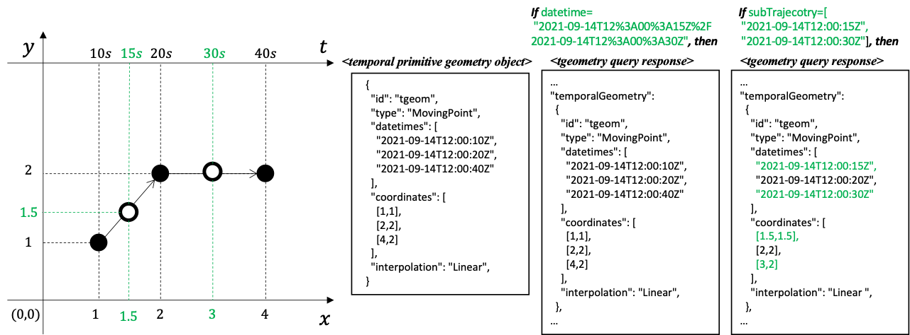

[[resource-movingfeatures-section]]
=== Resource MovingFeatures
==== Overview
The *MovingFeatures* resource supports retrieving and creating operations via GET and POST HTTP methods respectively.

. A retrieve operation returns a set of features which describes the moving feature available from this API.
. A create operation posts a new <<resource-movingfeature-section,*MovingFeature*>> resource instance to a specific <<resource-collection-section,*Collection*>> (specified by `+{collectionId}+` with this API.

The OGC API — MF `Items` query is an OGC API — Features endpoint that may be used to catalog pre-existing moving features.
If a `+{mFeatureID}+` is not specified, the query will return a list of the available moving features.
The list of moving features returned to the response can be limited using the <<bbox-section,`bbox`>>, <<datetime-section,`datetime`>>, <<limit-section,`limit`>>, and <<subtrajecotry-section,`subTrajectory`>> query parameters.
This behavior and query parameters for use with the `Items` query are specified in OGC API — Features and OGC API — Common, except <<subtrajecotry-section,`subTrajectory`>> parameter.

==== Query Parameters
Query parameters are used in URLs to define the resources which are returned on a GET request.

The query parameters link:http://docs.opengeospatial.org/DRAFTS/20-024.html#bbox-parameter-requirements[`bbox`], link:http://docs.opengeospatial.org/DRAFTS/20-024.html#datetime-parameter-requirements[`datetime`], and link:http://docs.opengeospatial.org/DRAFTS/20-024.html#limit-parameter-requirements[`limit`] are inherited from OGC API — Common.

[[subtrajecotry-section]]
===== Parameter subTrajectory
The `subTrajectory` query parameter is defined as follows:
include::requirements/parameter/REQ_parameter-subtrajectory-definition.adoc[]
include::requirements/parameter/REQ_parameter-subtrajectory-response.adoc[]

The `subTrajectory` query parameter is used to select a subsequence of <<resource-temporalGeometrySequence-section,*TemporalGeometrySequence*>> for the specified time interval.
Each <<resource-movingfeature-section,*MovingFeature*>> in the *MovingFeatures* has *TemporalGeometrySequence*.
The `subTrajectory` parameter is used to implement the *_subTrajectory_* operation, which is defined in the link:https://docs.opengeospatial.org/is/16-120r3/16-120r3.html#12[OGC Moving Feature Access Standard].
This operation required two timestamps (_newStartTime_ and _newEndTime_) to represent a specified time interval.
The time interval for the subTrajectory operation is taken from `datetime` parameter.

If the `subTrajectory` parameter is provided by the client, the endpoint SHALL return only a subset of the trajectory derived from temporal primitive geometry by the  operation at time (_newStartTime_ and _newEndTime_) included in the `subTrajectory` parameter, using interpolated trajectory according to the `interpolation` property in <<resource-temporalPrimitiveGeometry-section,*TemporalPrimitiveGeometry*>>.
The `interpolation` property in the response shall be the same as the original temporal primitive geometry.

// Note that the *_subTrajectory_* operation is defined in the link:https://docs.opengeospatial.org/is/16-120r3/16-120r3.html#12[OGC Moving Feature Access Standard].

[[subtrajectory-example]]
.Example of a response result with `subTrajectory` parameter

==== Operation
===== Retrieve
The retrieve operation is defined in the `Features` conformance class of OGC API — Features.
Additional support for query parameter `subTrajectory` is needed to support <<resource-movingfeatures-section,*MovingFeatures*>> resource.

. Issue a `GET` request on `+{root}+/collections/+{collectionID}+/items` path

Support for GET on the `+{root}+/collections/+{collectionID}+/items` path is required by OGC API — Features.
include::requirements/movingfeature/features/REQ_operation-features-get.adoc[]

====== Create
The create operation is defined in the `link:http://docs.ogc.org/DRAFTS/20-002.html#create[CREATE]` conformance class of OGC API — Features.
This operation targeted <<resource-movingfeature-section,*MovingFeature*>> resource.

. Issue a `POST` request on `+{root}+/collections/+{collectionID}+/items` path

Support for the HTTP POST method is specified as a requirement in OGC API — Features.

include::requirements/movingfeature/features/REQ_operation-features-post.adoc[]

The following example adds a new feature (link:https://docs.opengeospatial.org/is/19-045r3/19-045r3.html#mfeature[*_MovingFeature_* object] in <<OGC-MF-JSON,MF-JSON>>) to the specific <<resource-collection-section,*Collection*>>.
The feature is represented as *_MovingFeature_* object (or *_MovingFeatureCollection_* object) in MF-JSON.
A pseudo-sequence diagram notation is used to illustrate the details of the HTTP communication between the client and the server.
[#movingfeature-post-example, reftext='Create a New MovingFeature Object Example']
.An Example of Creating a New MovingFeature Object:
include::examples/features-post.adoc[]

==== Response
===== Retrieve
A successful response to the *MovingFeatures* GET operation is a document that contains the static data for a set of moving features.

If the value of the `subTrajectory` query parameter is provided, the value of the corresponding `temporalGeometry` property of each moving feature is calculated using the `subTrajectory` parameter value and included in the result, i.e., a link:https://docs.ogc.org/is/19-045r3/19-045r3.html#mfeaturecollection[*_MovingFeatureCollection_* object] of <<OGC-MF-JSON,MF-JSON>>.

In a typical deployment of the OGF API — MF, the *MovingFeatures* GET response will list <<resource-movingfeature-section,*MovingFeature*>> resource.

include::requirements/movingfeature/features/REQ_response-features-get.adoc[]

[#features-schema,reftext='MovingFeatures GET Response Schema']
.MovingFeatures GET Response Schema (movingFeatureCollection.yaml):
[source,yaml]
----
include::../openapi/schemas/movingFeatures.yaml[]
----
// .crs.yaml
// [source,yaml]
// ----
// include::../openapi/schemas/crs.yaml[]
// ----
// .trs.yaml
// [source,yaml]
// ----
// include::../openapi/schemas/trs.yaml[]
// ----

The following JSON payload is an example of a response to an OGC API — Moving Features *MovingFeatures* GET operation.
[#features-example,reftext=`MovingFeatures Example`]
.An Example of a MovingFeatures GET Operation:
[source,json]
----
include::../openapi/examples/movingFeatures.json[]
----

====== Create
A successful response to the *MovingFeatures* POST operation is an HTTP status code.

include::requirements/movingfeature/features/REQ_response-features-post.adoc[]

==== Error situations
The requirements for handling unsuccessful requests are provided in the <<http-response>>.
General guidance on HTTP status codes and how they should be handled is provided in <<http-status-codes>>.