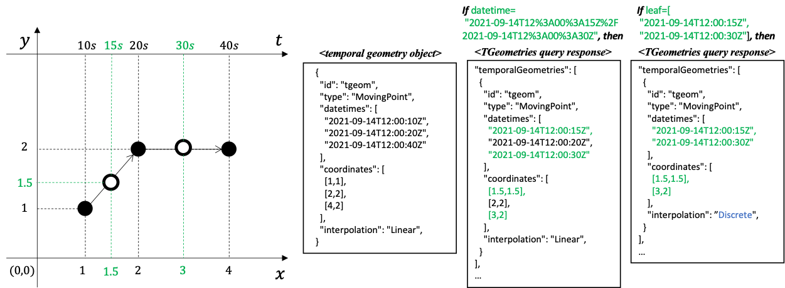

[[resource-temporalGeometrySequence-section]]
=== Resource TemporalGeometrySequence
==== Overview
The *TemporalGeometrySequence* resource supports retrieving and creating operations via GET and POST HTTP methods respectively.

. A retrieve operation returns a sequence of <<resource-temporalPrimitiveGeometry-section,*TemporalPrimitiveGeometry*>> object which is included in the <<resource-movingfeature-section,*MovingFeature*>> that specified by <<movingfeature-identifier,`{mFeatureId}`>>.
The sequence of <<resource-temporalPrimitiveGeometry-section,*TemporalPrimitiveGeometry*>> object returned to the response can be limited using the query parameters <<limit-section,`limit`>>, <<bbox-section,`bbox`>>, <<datetime-section,`datetime`>>, and <<leaf-section,`leaf`>> (or <<subtrajecotry-section,`subTrajectory`>>).
. A create operation posts a new <<resource-temporalPrimitiveGeometry-section,*TemporalPrimitiveGeometry*>> resource to the <<resource-movingfeature-section,*MovingFeature*>> that specified by <<movingfeature-identifier,{mFeatureId}>>.

==== Query Parameters
Query parameters are used in URLs to define the resources which are returned on a GET request.

The query parameters link:http://docs.opengeospatial.org/DRAFTS/20-024.html#bbox-parameter-requirements[`bbox`], link:http://docs.opengeospatial.org/DRAFTS/20-024.html#datetime-parameter-requirements[`datetime`], and link:http://docs.opengeospatial.org/DRAFTS/20-024.html#limit-parameter-requirements[`limit`] are inherited from OGC API — Common.

The <<subtrajecotry-section,`subTrajectory`>> query parameter is defined in the <<resource-movingfeatures-section,*MovingFeatures*>> clause.

[[leaf-section]]
===== Parameter leaf
The `leaf` query parameter is defined as follows:
include::requirements/parameter/REQ_parameter-leaf-definition.adoc[]
include::requirements/parameter/REQ_parameter-leaf-response.adoc[]

The `leaf` parameter is a sequence of monotonic increasing instants represented by date-time strings (ex. "2018-02-12T23:20:50Z") whose structure adheres to link:https://datatracker.ietf.org/doc/html/rfc3339[IETF RFC3339].
The `leaf` parameter consists of a list of the date-time format strings, different from <<datetime-section,`datetime`>> parameter.
The list does not allow the same element value.
<<leaf-text-example>> shows valid expression examples of the `leaf` parameter.

[[leaf-text-example]]
.leaf parameter valid (and invalid) Examples
[source]
----
(O) "2018-02-12T23:20:50Z"

(O) "2018-02-12T23:20:50Z","2018-02-12T23:30:50Z"

(O) "2018-02-12T23:20:50Z","2018-02-12T23:30:50Z","2018-02-12T23:40:50Z"

(X) "2018-02-12T23:20:50Z","2018-02-12T23:20:50Z"

(X) "2018-02-12T23:20:50Z","2018-02-12T22:40:50Z"
----

If the `leaf` parameter is provided by the client, the endpoint returns only temporal geometry coordinate (or temporal property value) with the leaf query at each time included in the `leaf` parameter, similar to _**pointAtTime**_ operation in the link:https://docs.opengeospatial.org/is/16-120r3/16-120r3.html#12[OGC Moving Feature Access Standard].
The `interpolation` property in the response shall be "Discrete".

[[leaf-example]]
.Example of a response result with `leaf` parameter

==== Operation
===== Retrieve
. Issue a `GET` request on the `{root}/collections/{collectionId}/items/{mFeatureId}/tgsequence` path

include::requirements/movingfeature/tgsequence/REQ_operation-tgsequence-get.adoc[]

====== Create
The create operation is defined in the `link:http://docs.ogc.org/DRAFTS/20-002.html#create[CREATE]` conformance class of OGC API — Features.
This operation targeted <<resource-temporalPrimitiveGeometry-section,*TemporalPrimitiveGeometry*>> resource.

. Issue a `POST` request on `{root}/collections/{collectionId}/items/{mFeatureId}/tgsequence` path

Support for the HTTP POST method is specified as a requirement in OGC API — Features.

include::requirements/movingfeature/tgsequence/REQ_operation-tgsequence-post.adoc[]

The following example adds a new feature (link:https://docs.ogc.org/is/19-045r3/19-045r3.html#tprimitive[*_TemporalPrimitiveGeometry_* object] in <<OGC-MF-JSON,MF-JSON>>) to the feature created by the <<movingfeature-post-example,Creation a MovingFeature Example>>.
The feature is represented as *_TemporalPrimitiveGeometry_* object in <<OGC-MF-JSON,MF-JSON>>, which is an extension of the JSON.
//And it added to the current temporal geometry object as continuously one, because the time difference between these two temporal geometry objects is less than (or equal to) the update frequency of the created Collection feature by the <<collections-post.adoc-example,Create a New Collection Example>>.
A pseudo-sequence diagram notation is used to illustrate the details of the HTTP communication between the client and the server.

[[tpgeometry-post-example]]
.An Example of Creating a New TemporalPrimitiveGeometry Object:
include::examples/temporalGeometry-post.adoc[]

==== Response
===== Retrieve
A successful response to the *TemporalGeometrySequence* GET operation is a document that contains the set of temporal geometry of the moving feature identified by the <<movingfeature-identifier,`{mFeatureId}`>> parameter.

include::requirements/movingfeature/tgsequence/REQ_response-tgsequence-get.adoc[]

// TODO: Fix for including not only MovingGeometryCollection, also MovingGeometryPrimitive
[[tgsequence-schema]]
.TemporalGeometrySequence GET Response Schema (temporalGeometrySequence.yaml):
[source,yaml]
----
include::../openapi/schemas/temporalGeometrySequence.yaml[]
----

[[tpgeometry-schema]]
// .TemporalPrimitiveGeometry Schema (MF-JSON/Prism/temporalPrimitiveGeometry.yaml):
// [source,yaml]
// ----
// include::../openapi/schemas/MF-JSON/Prism/temporalPrimitiveGeometry.yaml[]
// ----

The following JSON payload is an example of a response to an OGC API — Moving Features *TemporalGeometrySequence* GET operation.
[[tgsequence-example]]
.An Example of a TemporalGeometrySequence GET operation:
[source,json]
----
include::../openapi/examples/temporalGeometrySequence.json[]
----

====== Create
A successful response to the *TemporalGeometrySequence* POST operation is an HTTP status code.

include::requirements/movingfeature/tgsequence/REQ_response-tgsequence-post.adoc[]

==== Error situations
The requirements for handling unsuccessful requests are provided in the <<http-response>>.
General guidance on HTTP status codes and how they should be handled is provided in <<http-status-codes>>.